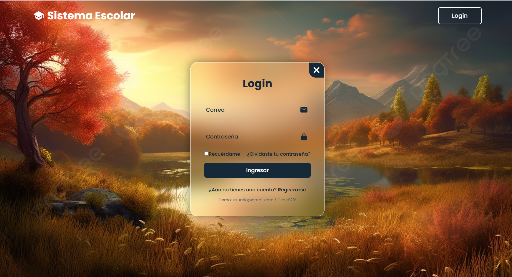
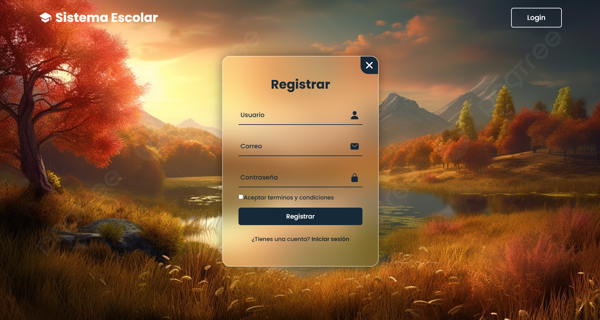
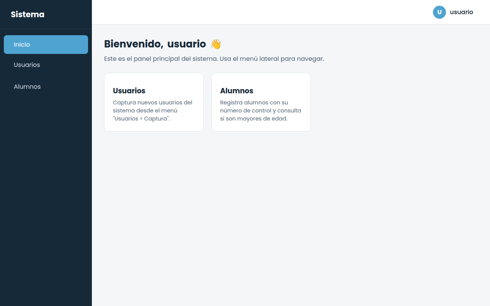
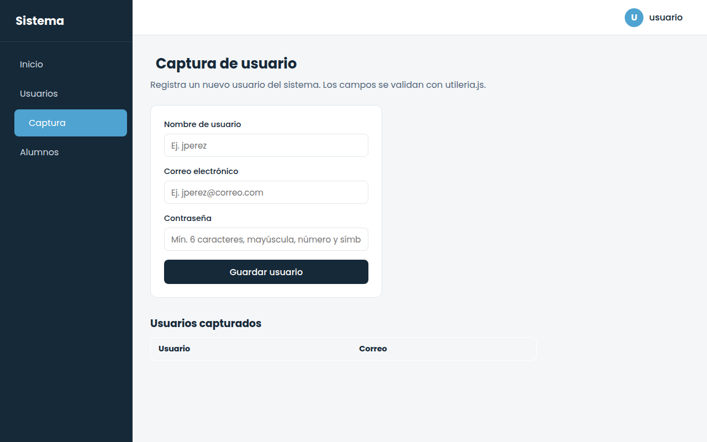
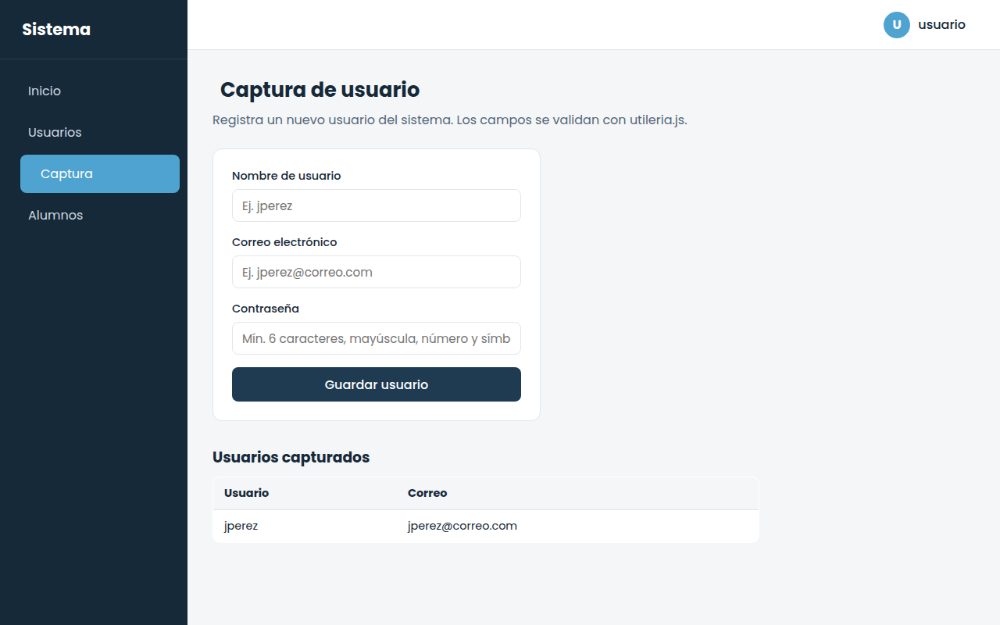
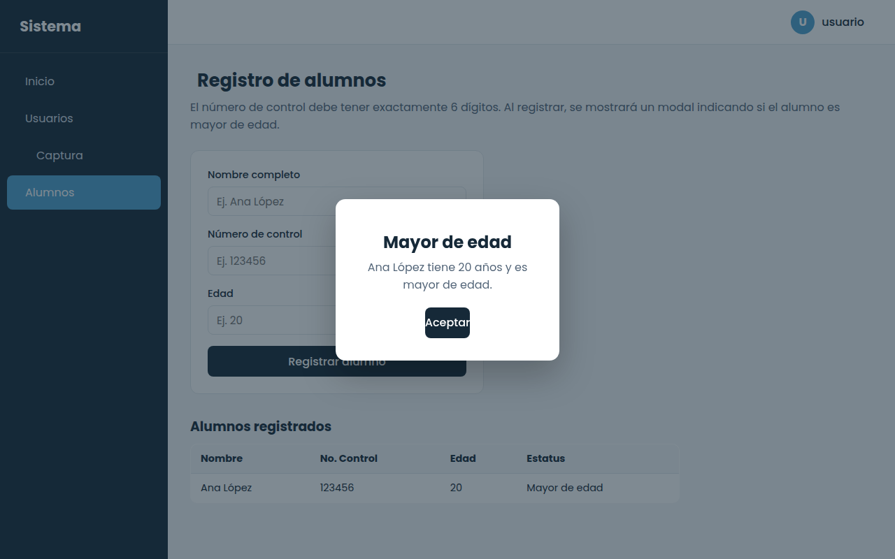
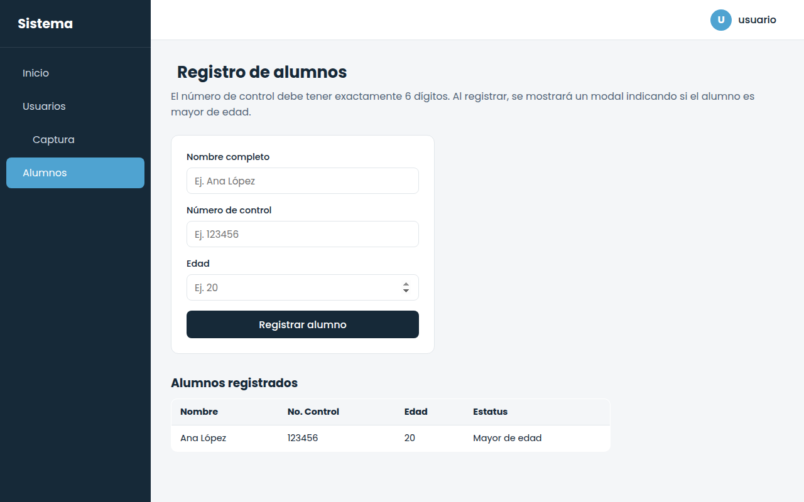
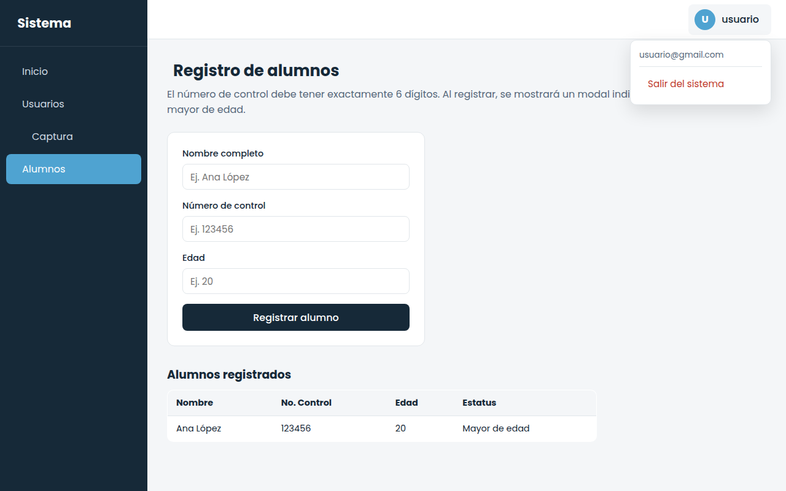

# 🔐 Sistema de Login Simulado

### Portada

| | |
|---|---|
| **Proyecto** | Login funcional con acceso simulado a un sistema |
| **Integrantes** | Integrante 1 — Paris Lizette Gomez Gracia|
| **Tecnologías** | HTML5, CSS, JavaScript |

**Descripción breve:** proyecto de dos pantallas conectadas que simula el acceso a un
sistema. `login.html` valida correo y contraseña (o permite registrarse) y, si la
validación pasa, redirige a `index.html`, un panel con sidebar, navbar, captura de
usuarios y registro de alumnos con un modal que indica si el alumno es mayor de edad.
Todo el flujo funciona sin backend: la sesión se simula con `sessionStorage`.


---

## 1. Documentación técnica

### ¿Qué framework de CSS se usó?
Ninguno (ni Bootstrap ni Tailwind). Los estilos son CSS puro escrito a la medida,
en `css/login.css` (pantalla de acceso) y `css/index.css` (panel del sistema), usando
variables CSS (`:root`) para mantener una paleta consistente entre ambas pantallas.

### ¿Cómo fluye el login hacia el sistema?
1. El usuario abre `login.html` y llena el formulario de **Login** (correo y
   contraseña) o el de **Registrar** (usuario, correo, contraseña).
2. `js/login.js` valida los campos usando las funciones de `js/utileria.js`
   (`validarCorreo`, `validarPassword`, `validarNoVacio`).
3. Si el registro es correcto, el usuario se guarda temporalmente en
   `sessionStorage` (clave `usuariosRegistrados`) para poder iniciar sesión con esos
   datos. También existe un usuario de demostración ya cargado:
   - Correo: `usuario@gmail.com`
   - Contraseña: `Clave123!`
4. Si el login es correcto, se guarda el usuario activo en `sessionStorage`
   (clave `usuarioActivo`, con `nombre` y `correo`) y el navegador redirige a
   `index.html` con `window.location.href`.
5. `index.html` revisa al cargar si existe `usuarioActivo` en `sessionStorage`.
   Si no existe (por ejemplo, si alguien intenta entrar directo a `index.html` sin
   pasar por el login), se redirige de regreso a `login.html`, simulando una ruta
   protegida.
6. Al dar clic en **Salir del sistema** (menú del navbar), se borra `usuarioActivo`
   de `sessionStorage` y se regresa a `login.html`.

### ¿Cómo se pasa el nombre de usuario del login al navbar?
Se usa el **Web Storage API** (`sessionStorage`), que persiste solo durante la
pestaña/sesión del navegador — sin backend ni base de datos:

```js
// login.js — al iniciar sesión correctamente
sessionStorage.setItem('usuarioActivo', JSON.stringify({
    nombre: nombreMostrado,
    correo: email
}));
window.location.href = 'index.html';
```

```js
// index.js — al cargar el panel
const usuarioActivo = JSON.parse(sessionStorage.getItem('usuarioActivo') || 'null');
document.getElementById('usuario-nombre').textContent = usuarioActivo.nombre;
document.getElementById('usuario-correo').textContent = usuarioActivo.correo;
```

### ¿Cuáles son los métodos principales?

**`js/utileria.js`** (librería de validaciones compartida por login e index):
| Función | Qué hace |
|---|---|
| `validarCorreo(correo)` | Verifica formato de correo con regex |
| `validarPassword(pass)` | Mínimo 6 caracteres, mayúscula, minúscula, número y carácter especial |
| `validarNumControl(numControl, longitud)` | Verifica que sea numérico y tenga exactamente `longitud` dígitos (6 por defecto) |
| `validarNoVacio(valor)` | Verifica que un campo no esté vacío |
| `esMayorDeEdad(edad)` | Regresa `true`/`false` si `edad >= 18` |
| `mostrarAlerta(mensaje)` | Punto único para mostrar mensajes al usuario |

**`js/login.js`**: controla la animación de las tarjetas login/registro, valida
ambos formularios con `utileria.js`, gestiona el registro simulado y guarda/lee
`usuarioActivo` en `sessionStorage`.

**`js/index.js`**: protege la vista (redirige a login si no hay sesión), controla
el sidebar (colapsar/expandir y menú móvil), el submenú **Usuarios → Captura**, la
navegación entre vistas, el dropdown del navbar, el cierre de sesión, la captura de
usuarios y el registro de alumnos junto con el modal de mayoría de edad.

---

## 2. Proceso de creación (paso a paso)

**Paso 1 — Login.**
Se partió de una tarjeta de vidrio (`backdrop-filter: blur`) con dos formularios
(login/registro) que se deslizan con `transform: translateX()`. Se sustituyó la
validación manual en línea por llamadas a `utileria.js` y se agregó el guardado del
usuario en `sessionStorage` antes de redirigir a `index.html`.

<p align="center"></p>

**Paso 2 — Registro.**
Se conserva la tarjeta de registro (usuario, correo, contraseña, términos), también
validada con `utileria.js`. Al registrarse correctamente, el usuario queda disponible
para iniciar sesión con esos datos.

<p align="center"></p>

**Paso 3 — Sidebar y navbar de `index.html`.**
Se construyó un layout de dos columnas: un `<aside class="sidebar">` fijo con logo,
botón hamburguesa (colapsa/expande el menú) y una lista de opciones; y un
`<header class="navbar">` con el nombre del usuario activo a la derecha.

<p align="center"></p>

**Paso 4 — Submenú Usuarios → Captura.**
El botón **Usuarios** del sidebar despliega un submenú con la opción **Captura**,
que muestra un formulario (usuario, correo, contraseña) validado con
`validarCorreo` y `validarPassword`. Los registros se agregan a una tabla en pantalla.

<p align="center"></p>
<p align="center"></p>

**Paso 5 — Formulario de alumnos y número de control.**
Se agregó la vista **Alumnos** con nombre, **número de control** (validado a
exactamente 6 dígitos con `validarNumControl`) y edad.

**Paso 6 — Modal de edad.**
Al registrar un alumno, se calcula con `esMayorDeEdad(edad)` si es mayor o menor de
edad y se muestra un modal (`.modal-overlay`) con el resultado, además de agregarse
una fila a la tabla de alumnos con su estatus.

<p align="center"></p>
<p align="center"></p>

**Paso 7 — Navbar con dropdown y cierre de sesión.**
Al hacer clic en el nombre de usuario (parte derecha del navbar) se despliega un
menú con el correo y la opción **Salir del sistema**, que limpia `sessionStorage`
y regresa a `login.html`.

<p align="center"></p>
<p align="center"></p>

---

## 3. Estructura del repositorio

```
├── README.md
├── login.html
├── index.html
├── css/
│   ├── login.css
│   └── index.css
├── js/
│   ├── utileria.js      # librería de validaciones compartida
│   ├── login.js         # lógica de login.html
│   └── index.js         # lógica de index.html
└── img/
    └── capturas/         # capturas de pantalla del flujo funcionando
```

---

## 4. Cómo probarlo localmente

No requiere instalación ni backend. Basta con abrir `login.html` en el navegador
(o servirlo con una extensión tipo *Live Server*) e iniciar sesión con:

- **Correo:** `usuario@gmail.com`
- **Contraseña:** `Clave123!`

o registrar un usuario nuevo desde la propia pantalla de login.

---

## 5. Enlaces de entrega

- 🔗 **Repositorio:** _pega aquí el link del repositorio público de GitHub_
- 🌐 **GitHub Pages (demo en vivo):** https://minparis.github.io/Login/

---

